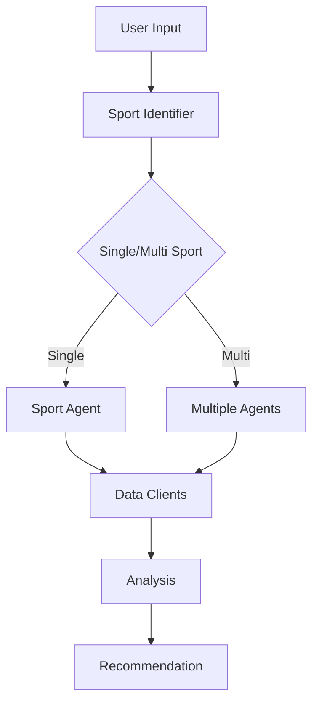

# Technical Documentation

## System Architecture

### Core Components

1. **Base Agent (`BaseAgent`)** - Abstract base class for all sport-specific agents
   - Provides common analysis methods
   - Handles data client initialization
   - Implements shared calculations (EV, Kelly, risk assessment)

2. **Sport-Specific Agents**
   - `NFLBettingAgent`: Football analysis
   - `NBABettingAgent`: Basketball analysis
   - `UFCBettingAgent`: MMA analysis
   Each implements:
   - Sport-specific prop types
   - Custom analysis methods
   - Sport-specific risk factors

3. **Coordinator (`SportsBettingCoordinator`)**
   - Manages all sport-specific agents
   - Handles multi-sport parlay analysis
   - Performs correlation detection
   - Generates final recommendations

4. **Data Clients**
   - `SportsDataClient`: Historical stats and performance data
   - `OddsClient`: Real-time odds from multiple bookmakers
   - `WeatherClient`: Weather data for outdoor sports

### Data Flow



## API Reference

### SportsBettingCoordinator

```python
class SportsBettingCoordinator:
    async def analyze_bet(text: str) -> Dict[str, Any]:
        """
        Analyzes a betting opportunity from text input.
        
        Args:
            text: Description of the bet(s) to analyze
            
        Returns:
            Dictionary containing analysis results
        """

    async def _analyze_multi_sport_parlay(
        text: str,
        sports: List[str]
    ) -> Dict[str, Any]:
        """
        Analyzes a parlay involving multiple sports.
        
        Args:
            text: Original bet description
            sports: List of identified sports
            
        Returns:
            Dictionary containing parlay analysis
        """
```

### BaseAgent

```python
class BaseAgent(ABC):
    @abstractmethod
    async def analyze(self, context: Dict[str, Any]) -> Dict[str, Any]:
        """
        Analyzes a betting opportunity.
        
        Args:
            context: Dictionary containing all relevant information
            
        Returns:
            Dictionary containing analysis results
        """

    def _calculate_expected_value(
        self,
        probability: float,
        odds: float
    ) -> float:
        """
        Calculates expected value of a bet.
        
        Args:
            probability: Estimated probability of winning
            odds: American odds for the bet
            
        Returns:
            Expected value as a decimal
        """
```

## Data Structures

### Context Dictionary
```python
context = {
    'sport': str,              # Sport identifier
    'market_type': str,        # Type of bet
    'player': str,             # Optional: Player name for props
    'team': str,              # Optional: Team name
    'line': float,            # Betting line
    'odds': Dict[str, Any],   # Current odds
    'stats': Dict[str, Any],  # Historical statistics
    'weather': Dict[str, Any]  # Optional: Weather data
}
```

### Analysis Result
```python
analysis = {
    'recommendation': str,     # 'Pass', 'Consider', 'Strong Consider'
    'confidence': float,       # 0.0 to 1.0
    'expected_value': float,   # Adjusted EV
    'raw_ev': float,          # Raw EV before adjustments
    'risk_assessment': Dict,   # Risk factors and level
    'key_factors': List[str], # Important considerations
    'timestamp': str          # ISO format timestamp
}
```

## Implementation Details

### Correlation Detection

1. **Same-Day Games**
```python
independence_score *= 0.9  # 10% correlation penalty
```

2. **Market Relationships**
```python
independence_score *= 0.8  # 20% correlation penalty
```

3. **External Factors**
```python
independence_score *= 0.95  # 5% correlation penalty
```

### Risk Assessment

Risk scores are calculated based on:
- Number of risk factors (each worth 1 point)
- Severity of factors (high impact = 2 points)
- Correlation penalties
- Line movement significance

Final risk levels:
- Low: 0-1 points
- Medium: 2-3 points
- High: 4+ points

## Error Handling

1. **API Failures**
   - Retry with exponential backoff
   - Cache fallback for non-critical data
   - Default to conservative estimates

2. **Missing Data**
   - Use historical averages
   - Increase risk assessment
   - Lower confidence scores

3. **Invalid Input**
   - Return descriptive error messages
   - Suggest correct formats
   - Partial analysis when possible

## Performance Considerations

1. **Caching**
   - Odds: 5 minutes TTL
   - Stats: 1 hour TTL
   - Weather: 1 hour TTL

2. **Async Operations**
   - Parallel API requests
   - Non-blocking analysis
   - Concurrent agent processing

3. **Memory Management**
   - Regular cache cleanup
   - Limit analysis history
   - Optimize data structures

## Future Enhancements

1. **Additional Sports**
   - MLB Agent
   - NHL Agent
   - Soccer Agent

2. **Advanced Analysis**
   - Machine learning models
   - Time series analysis
   - Regression testing

3. **Performance Optimization**
   - Distributed processing
   - Enhanced caching
   - Query optimization 