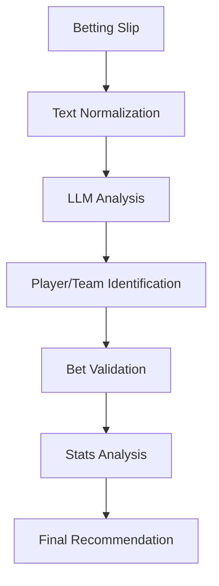

# Technical Documentation

## System Architecture

### Core Components

1. **Bet Analyzer (`BetAnalyzer`)** - Main class for bet analysis
   - Handles bet extraction and validation
   - Manages LLM integration
   - Performs statistical analysis
   - Implements risk assessment

2. **LLM Integration**
   - Uses DeepSeek AI for:
     - Player identification
     - Team recognition
     - Bet type classification
     - Validation checks

3. **Data Client**
   - `SportsDataClient`: Historical stats and performance data
   - Player statistics
   - Team information
   - Historical performance metrics

### Data Flow



## API Reference

### BetAnalyzer

```python
class BetAnalyzer:
    async def analyze_bets(text: str) -> Dict[str, Any]:
        """
        Analyzes betting opportunities from a betting slip.
        
        Args:
            text: Betting slip text
            
        Returns:
            Dictionary containing analysis results
        """

    async def _extract_bets(
        self,
        text: str
    ) -> List[Dict[str, Any]]:
        """
        Extracts individual bets from betting slip text.
        
        Args:
            text: Original betting slip text
            
        Returns:
            List of dictionaries containing extracted bets
        """

    async def _normalize_text(
        self,
        text: str
    ) -> str:
        """
        Normalizes betting slip text using LLM.
        
        Args:
            text: Raw betting slip text
            
        Returns:
            Normalized text with corrected player names
        """
```

## Data Structures

### Bet Dictionary
```python
bet = {
    'player': str,            # Player name
    'team': str,             # Team name
    'bet_type': str,         # Type of bet
    'line': float,           # Betting line
    'odds': int,             # American odds
    'is_complete': bool      # Whether all required info is present
}
```

### Analysis Result
```python
analysis = {
    'bets': List[Dict],      # List of analyzed bets
    'overall_analysis': {
        'complete_legs': int,    # Number of complete bets
        'risk_level': str,       # Risk assessment
        'recommendations': List   # List of recommendations
    },
    'timestamp': str         # ISO format timestamp
}
```

## Implementation Details

### Text Normalization

The system uses LLM to:
1. Correct OCR errors in player names
2. Standardize team names
3. Format bet types consistently
4. Extract numerical values accurately

### Bet Validation

Bets are considered valid when:
1. Player and team are confidently identified
2. Bet type is recognized
3. Line value is present and valid
4. Odds are specified and valid

### Risk Assessment

Risk scores are calculated based on:
- Confidence in player identification
- Completeness of bet information
- Historical performance data
- Statistical variance

## Error Handling

1. **Incomplete Bets**
   - Skip bets missing critical information
   - Log skipped bets for review
   - Continue with complete bets

2. **Player Identification**
   - Use confidence thresholds
   - Skip uncertain matches
   - Provide feedback on ambiguous names

3. **Invalid Input**
   - Return descriptive error messages
   - Suggest correct formats
   - Partial analysis when possible

## Performance Considerations

1. **LLM Optimization**
   - Batch processing when possible
   - Reuse normalized text
   - Cache common responses

2. **Async Operations**
   - Parallel bet processing
   - Non-blocking analysis
   - Concurrent data retrieval

3. **Memory Management**
   - Efficient text processing
   - Optimize data structures
   - Clean processing pipeline

## Future Enhancements

1. **Enhanced Analysis**
   - Multi-sport correlation detection
   - Advanced statistical models
   - Historical trend analysis

2. **Improved Accuracy**
   - Enhanced player recognition
   - Better OCR correction
   - More bet types support

3. **Performance Optimization**
   - Smarter caching
   - Batch processing
   - Response optimization 